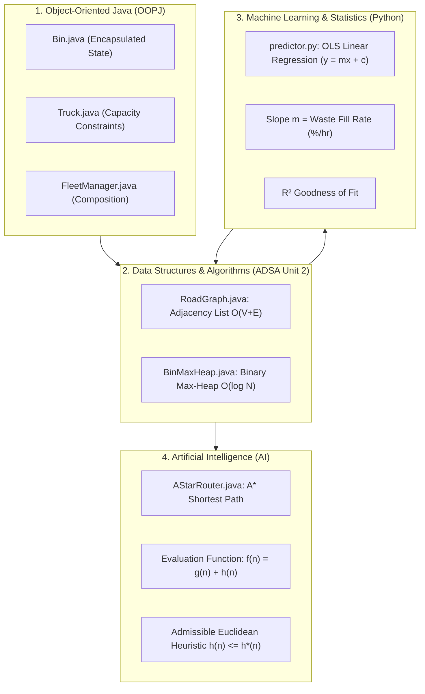
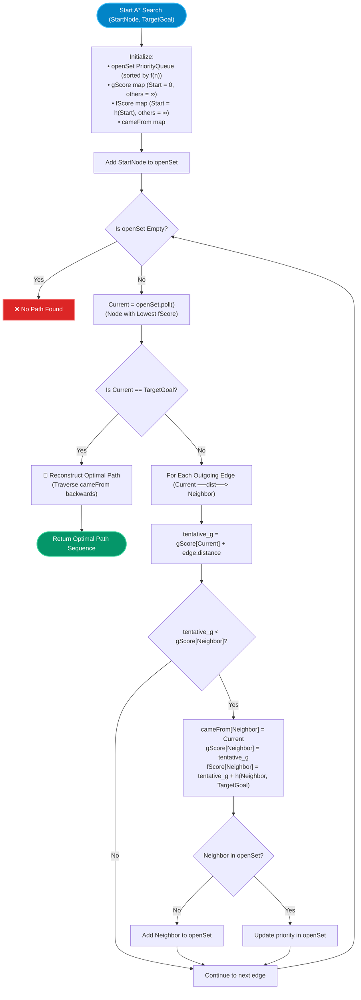
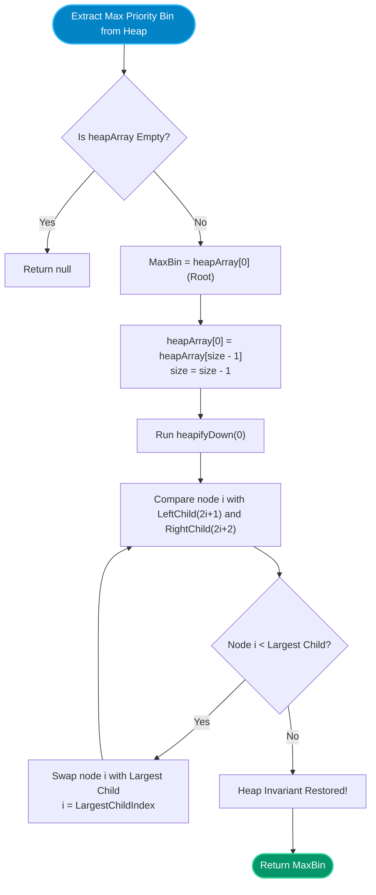

# 🚛 Smart Waste Collection Router (Team 10)
# Comprehensive Project Documentation & Technical Architecture Guide

---

## 📌 1. Project Overview & Problem Statement

### 1.1 The Real-World Municipal Challenge
In conventional city waste management systems, municipal garbage trucks follow a **static, predetermined schedule**. Every single garbage bin across the city is visited in a fixed sequence every single day, regardless of whether a bin is:
- **Almost Empty (10% - 20% full):** Truck wastes time and fuel driving to it unnecessarily.
- **Rapidly Overflowing (80% - 100% full):** Causes health hazards, littering, and bad odor because it must wait for its scheduled turn.

#### Consequences of Conventional Systems:
1. ⛽ **Excessive Fuel Consumption:** Trucks drive 50–60 km daily on blind routes.
2. 🌍 **High Carbon Emissions ($\text{CO}_2$):** Tons of greenhouse gas emitted per year.
3. 🚦 **Traffic Congestion:** Large municipal vehicles block narrow streets unnecessarily.
4. 💰 **High Operational Costs:** Wasted municipal taxpayer budget on diesel and labor.

---

### 1.2 The Smart Waste Router Solution
The **Smart Waste Collection Router** transforms garbage collection from a *passive, fixed schedule* into an **intelligent, predictive, dynamic routing system**:

```
[IoT Bin Sensors] ──(Hourly Readings)──> [Python Linear Regression]
                                                  │
                                          (Computes Slope m = %/hr)
                                                  │
                                                  ▼
[Adjacency List Graph O(V+E)] <──── [ADSA Binary Max-Heap]
            │                              │
            │                  (Extracts Urgent Bins O(log N))
            ▼                              ▼
    [AI A* Shortest Path Router (f = g + h)] ───> [Optimal 33.9 km Route (39.5% Fuel Saved!)]
```

1. **Monitors:** Smart IoT waste bins measure fill volume in real time.
2. **Predicts:** Python's **Ordinary Least Squares (OLS) Linear Regression** analyzes time-series readings and computes the exact **waste accumulation rate** ($m = \%/\text{hr}$).
3. **Prioritizes:** An **ADSA Binary Max-Heap Priority Queue** dynamically elevates fast-filling and overflowing bins to the root ($O(\log N)$).
4. **Optimizes:** An **AI A\* Search Algorithm** with an admissible Euclidean heuristic navigates the city road network, calculating the mathematically optimal shortest route visiting **only bins that need collection**.

---

## 📊 2. Performance Savings & Benchmarks

| Parameter | Conventional Fixed Route | Smart Waste Router (Our System) | Optimization Gain |
|---|---|---|---|
| **Total Route Distance** | 56.00 km | **33.90 km** | **22.10 km avoided (39.5% reduction)** |
| **Diesel Fuel Burned** | 16.00 Liters | **9.69 Liters** | **6.31 Liters saved per run** |
| **Bins Serviced** | 8 (blindly visited all) | **5 (urgent & high priority only)** | 3 unnecessary trips avoided |
| **$\text{CO}_2$ Prevented** | 42.88 kg | **25.96 kg** | **16.92 kg $\text{CO}_2$ saved per trip** |
| **Annual Impact (365 Days)** | 5,840 Liters | **3,537 Liters** | **2,303 Liters Diesel & 6.17 Tons $\text{CO}_2$ Saved!** |

---

## 🧠 3. Four Core Academic Pillars



---

### Pillar 1: Artificial Intelligence (AI) — A* Search Algorithm
- **File:** [`java/src/ai/AStarRouter.java`](file:///c:/Users/haris/OneDrive/Desktop/smart%20waste%20collection%20router%20team-10/java/src/ai/AStarRouter.java)
- **Evaluation Function:**
  $$f(n) = g(n) + h(n)$$
  - $g(n)$: Exact road distance traveled from the start node to current node $n$.
  - $h(n)$: Estimated straight-line (Euclidean) distance from node $n$ to the target bin:
    $$h(n) = \sqrt{(x_{\text{target}} - x_n)^2 + (y_{\text{target}} - y_n)^2}$$
  - $f(n)$: Total estimated route cost through node $n$.
- **Admissibility Proof:**
  Because physical roads have bends and detours, straight-line Euclidean distance is **always less than or equal to** actual road distance ($h(n) \le h^*(n)$). This provably guarantees that A* finds the optimal shortest path.
- **Why A* over Dijkstra?**
  Dijkstra expands nodes blindly in all directions ($f(n) = g(n)$). A* uses $h(n)$ to direct the search toward the destination, exploring far fewer states with less memory and CPU time.

---

### Pillar 2: Advanced Data Structures & Algorithms (ADSA Unit 2)
- **Files:** [`java/src/adsa/RoadGraph.java`](file:///c:/Users/haris/OneDrive/Desktop/smart%20waste%20collection%20router%20team-10/java/src/adsa/RoadGraph.java) & [`java/src/adsa/BinMaxHeap.java`](file:///c:/Users/haris/OneDrive/Desktop/smart%20waste%20collection%20router%20team-10/java/src/adsa/BinMaxHeap.java)
- **Adjacency List Graph:**
  - Memory complexity: $O(V + E)$ where $V$ is junctions/bins and $E$ is streets.
  - Far superior to $O(V^2)$ Adjacency Matrix for sparse city networks.
- **Binary Max-Heap Priority Queue:**
  - Stored sequentially in a 1D array (`Bin[] heapArray`) without pointer overhead.
  - **Parent Index:** $\lfloor(i - 1) / 2\rfloor$
  - **Left Child:** $2i + 1$
  - **Right Child:** $2i + 2$
  - **`insert(Bin)`:** $O(\log N)$ via `heapifyUp()`
  - **`extractMax()`:** $O(\log N)$ via `heapifyDown()`
  - **`peekMax()`:** $O(1)$ constant-time root inspection.

---

### Pillar 3: Object-Oriented Programming in Java (OOPJ)
- **Files:** [`java/src/model/Bin.java`](file:///c:/Users/haris/OneDrive/Desktop/smart%20waste%20collection%20router%20team-10/java/src/model/Bin.java), [`java/src/model/Truck.java`](file:///c:/Users/haris/OneDrive/Desktop/smart%20waste%20collection%20router%20team-10/java/src/model/Truck.java), [`java/src/oopj/FleetManager.java`](file:///c:/Users/haris/OneDrive/Desktop/smart%20waste%20collection%20router%20team-10/java/src/oopj/FleetManager.java)
- **Encapsulation:**
  - All critical state fields (`currentFillLiters`, `capacityLiters`, `fuelConsumedLiters`, `currentLoadLiters`) are declared `private`.
  - Mutations are guarded by public business methods like `loadWaste(int liters)`, strictly enforcing maximum capacity ($2500\text{ L}$).
- **Composition over Inheritance:**
  - `FleetManager` has a "has-a" relationship with `Truck` and `Bin` collections, allowing dynamic fleet addition and maintenance.
- **Comparable Interface:**
  - `Bin` implements `Comparable<Bin>`, encapsulating comparison logic based on dynamic priority score.

---

### Pillar 4: Python Machine Learning & Linear Regression
- **File:** [`python/predictor.py`](file:///c:/Users/haris/OneDrive/Desktop/smart%20waste%20collection%20router%20team-10/python/predictor.py)
- **Ordinary Least Squares (OLS) Formula:**
  $$y = mx + c$$
  $$m = \frac{N \sum (xy) - (\sum x)(\sum y)}{N \sum (x^2) - (\sum x)^2}, \quad c = \bar{y} - m\bar{x}$$
  - $x$: Time in hours (historical readings).
  - $y$: Recorded bin fill percentage.
  - **Slope $m$:** Waste fill accumulation rate (% per hour).
- **Goodness of Fit ($R^2$ Score):**
  $$R^2 = 1 - \frac{\sum (y_i - \hat{y}_i)^2}{\sum (y_i - \bar{y})^2}$$
  - An $R^2 \approx 0.999$ confirms reliable trend forecasting.
- **Decoupled Data Bridge:**
  - Java exports [`data/historical_fill_data.csv`](file:///c:/Users/haris/OneDrive/Desktop/smart%20waste%20collection%20router%20team-10/data/historical_fill_data.csv).
  - Python processes regression and writes [`data/predicted_fill_rates.json`](file:///c:/Users/haris/OneDrive/Desktop/smart%20waste%20collection%20router%20team-10/data/predicted_fill_rates.json).
  - Java reads the JSON and injects rates into the Max-Heap.

---

## 🔄 4. Detailed System Workflow & Flowcharts

### 4.1 Master End-to-End System Workflow

```mermaid
flowchart TD
    Start(["🚀 System Startup (Main.java / run.bat)"]) --> S1["Step 1: Initialize RoadGraph & Bins<br>• 8 Smart Bins + 1 Central Depot<br>• Adjacency List O(V+E)"]
    
    S1 --> S2["Step 2: Build Initial Max-Heap<br>• Ranked by Static Fill %<br>• BinMaxHeap O(log N)"]
    
    S2 --> S3["Step 3: Export Sensor Data to CSV<br>• DataBridge writes historical_fill_data.csv"]
    
    S3 --> S4["Step 4: Execute Python OLS Regression<br>• python/predictor.py reads CSV<br>• Calculates Slope m (%/hr) & R² fit<br>• Writes predicted_fill_rates.json"]
    
    S4 --> S5["Step 5: Dynamic Re-Prioritization<br>• Priority = Fill% + (m × 6h) + EmergencyBonus<br>• Rebuilds Max-Heap with predictive urgency"]
    
    S5 --> S6["Step 6: AI A* Shortest Path Planning<br>• Extract bins exceeding urgency threshold (>55.0)<br>• Evaluate f(n) = g(n) + h(n)<br>• Skip low-fill bins (saving 39.5% fuel)"]
    
    S6 --> S7["Step 7: Fleet Dispatch & Benchmark Audit<br>• Truck EcoFleet Alpha collects waste<br>• Log Distance: 33.9 km | Fuel: 9.69 L"]
    
    S7 --> Web["🌐 Launch Interactive Web Visualizer<br>• 2D/3D Canvas + Live Sandbox Slider<br>• Algorithm Arena + Viva Quiz Module"]
    
    Web --> Done(["🏁 End / Continuous Simulation Loop"])

    style Start fill:#0284c7,stroke:#38bdf8,stroke-width:2px,color:#fff
    style S6 fill:#059669,stroke:#34d399,stroke-width:2px,color:#fff
    style Web fill:#7c3aed,stroke:#a78bfa,stroke-width:2px,color:#fff
    style Done fill:#1e293b,stroke:#64748b,stroke-width:2px,color:#fff
```



---

### 4.2 AI A* Pathfinding Logic Flowchart



---

### 4.3 ADSA Binary Max-Heap Priority Extraction Flowchart



---

## 💻 5. Project Directory Structure & File Roles

```
smart-waste-collection-router-team-10/
│
├── java/                               # ☕ Java Source Code (AI, ADSA, OOPJ)
│   ├── src/
│   │   ├── model/
│   │   │   ├── Bin.java                # Smart Bin entity (fill level, priority, Comparable)
│   │   │   ├── Truck.java              # Collection truck (capacity constraints, diesel log)
│   │   │   └── Edge.java               # Road network weighted graph edge
│   │   ├── adsa/
│   │   │   ├── RoadGraph.java          # [ADSA] Adjacency List Graph (O(V + E))
│   │   │   └── BinMaxHeap.java         # [ADSA] Binary Max-Heap Priority Queue (O(log N))
│   │   ├── ai/
│   │   │   ├── AStarRouter.java        # [AI] A* Pathfinding with Euclidean heuristic
│   │   │   └── RoutePlan.java          # Multi-stop collection route plan
│   │   ├── oopj/
│   │   │   └── FleetManager.java       # [OOPJ] Composition-based fleet coordinator
│   │   ├── io/
│   │   │   └── DataBridge.java         # Java-Python decoupled file bridge
│   │   ├── test/
│   │   │   └── SystemTest.java         # Java verification & unit test suite
│   │   └── Main.java                   # Orchestrator running the complete 7-step pipeline
│   └── bin/                            # Compiled .class bytecode
│
├── python/                             # 🐍 Python Machine Learning & Analytics
│   ├── predictor.py                    # Ordinary Least Squares (OLS) Linear Regression
│   ├── simulator.py                    # Standalone Python simulation mirror
│   └── test_predictor.py               # Python regression unit tests
│
├── web/                                # 🌐 Interactive Visualizer Dashboard
│   ├── index.html                      # Semantic UI with 2D/3D map, tabs, & tech stack
│   ├── app.js                          # 60 FPS Canvas engine, audio synthesizer & quiz logic
│   └── style.css                       # Modern dark mode glassmorphism styles
│
├── data/                               # 📁 Decoupled Data Pipeline Files
│   ├── historical_fill_data.csv        # Hourly sensor readings exported by Java
│   └── predicted_fill_rates.json       # Slopes & R² scores exported by Python
│
├── tools/
│   └── jdk-17/                         # Portable OpenJDK 17 Runtime Environment
│
├── run.bat                             # 1-Click Windows Batch Runner script
├── run_server.py                       # Local HTTP Web Server for Dashboard
├── VIVA_QUESTIONS.md                   # Curated Viva Questions & Model Answers
├── STUDENT_GUIDE.md                    # Student Presentation & Viva Prep Guide
├── PROJECT_DOCUMENTATION.md            # This complete technical documentation
└── README.md                           # Repository Overview
```

---

## 🎛️ 6. Interactive Visualizer Dashboard Features

The web visualizer at `http://localhost:8000` provides:

1. **2D Plan View & 3D Isometric View:**
   - Toggle between standard 2D top-down and 3D isometric perspectives with depth-sorted building extrusions, cylinder fill pillars, and ground shadows.
2. **Real-Time Animated Collection Truck:**
   - Smooth 60 FPS path interpolation with directional headlights, ground glow rings, real-time load meter (`0 / 2500 L`), and odometer.
3. **Live Scenario Presets:**
   - 🌆 *Normal Day:* Standard weekday collection.
   - 🎪 *Market Rush:* Market and Mall bins fill 3x faster.
   - 🌧️ *Monsoon Flood:* Heavy rain accelerates accumulation in suburban sectors.
   - 🎓 *University Fest:* Tech University campus food streets overflow.
4. **Interactive Live Bin Sandbox Slider:**
   - Drag the fill slider of any bin (10% to 100%) and watch the Max-Heap, regression curve, and A* route dynamically re-render in real time!
5. **Algorithm Arena Switcher:**
   - Compare `🧠 Smart A* (AI)` (33.9 km / 9.69 L) vs `📊 Dijkstra` (48.2 km / 13.77 L) vs `🚛 Fixed Tour` (56.0 km / 16.0 L).
6. **Live Traffic Overlay:**
   - Toggle colored street congestion indicators and street names across the road network.
7. **Interactive Student Viva Quiz:**
   - 5-question self-assessment module with instant scoring, feedback explanations, and sound effects.
8. **Languages & Technologies Stack with Hover Tags:**
   - Interactive badge cards at the bottom displaying the role and files of each technology used on hover.
9. **Municipal Audit Report:**
   - Printable dispatch summary comparing conventional and smart routing performance.

---

## 🚀 7. How to Run the Project

### Method 1: 1-Click Batch Runner (Recommended)
1. Double-click [`run.bat`](file:///c:/Users/haris/OneDrive/Desktop/smart%20waste%20collection%20router%20team-10/run.bat).
2. Choose:
   - **`[1]`** to compile Java, run the pipeline, and launch the Web Dashboard in your browser.
   - **`[2]`** to run the Java and Python unit verification test suites.

### Method 2: Manual Terminal Execution (PowerShell)
```powershell
# 1. Run Python OLS Regression
python python/predictor.py

# 2. Compile and Run Java Master Pipeline
.\tools\jdk-17\bin\javac.exe -d java/bin (Get-ChildItem -Path java/src -Recurse -Filter *.java | Select-Object -ExpandProperty FullName)
.\tools\jdk-17\bin\java.exe -cp java/bin Main

# 3. Launch Web Visualizer
python run_server.py
```
Open **`http://localhost:8000`** in your browser.

---

*Prepared by Team 10 &bull; Ready for Project Reviews, Academic Vivas, and Final Demonstrations.*
